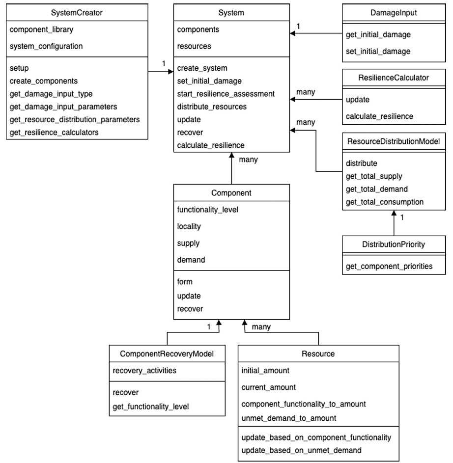

# Brief Description of pyrecodes
## General
iRe-CoDeS (Resilience-Compositional Demand/Supply) is bottom-up quantitative resilience assessment methodology proposed by \cite{pyrecodes} is described in detail.
The approach in applicable to systems for __finite a time period__ following a __single disaster__, and assesses resilience while considering the inter dependencies among its subsystems. __pyrecodes__ an open-source python implementation of the iRe-CoDeS framework.

In iRe-CoDeS framework resilience is quantifies the resilience of a system concerning a specific resource or service by contrasting the supply, demand, and consumption of the considered resource or service within the system during the resilience assessment interval. When the system's demand cannot be met by the available supply, a __Lack of Resilience (LoR)__ occurs.

## Bried Description of iRe-CoDeS framework
An interconnected system in iRe-CoDeS framework is modelled as omponents that exchanges resources and services (R/Ss) (ex: building material, labour or inspection services). For residential community, these component can be residential building which provides service of shelter, power plants which provides electricity, road networks which provides service of enabling exchange of R/Ss. 

The systems demand and supply capacity for a R/S at time $t$, $D_{sys,RS} (t)$ and $S_{sys,RS}^C(t)$, are defined as the aggregate of the demands and supply capacities of all components for that R/S at time $t$

$$ D_{sys,RS} (t) = \sum_{i \in (1,2,\dots,I)} D_{i,RS} (t) $$

$$ S_{sys,RS}^C(t) = \sum_{i \in (1,2,\dots,I)} S_{i,RS}^C (t) $$

where  $D_{i,RS} (t)$ and $S_{i,RS}^C (t)$ are the demand and supply capacity of component i for R/S at time t, respectively.

System R/S distribution model, $\phi_{RS}$ , simulates the transfer of the considered R/Ss among components, and accounts for the topology and the state of the R/S distribution network, dispatch/allocation strategies of the system operator and the physical laws that govern the distribution of the considered R/S. Finally, the amount of supply made available to a component $i$ at time $t$ for a R/S is estimated using distribution model is termed as $S_{i,RS}^{av} (t)$.

The amount of R/S component $i$ consumes at time $t$ , $C_{i,RS} (t)$, is the smaller of component’s demand $D_{i,RS} (t)$ and the supply available to the component, $S_{i,RS}^C (t)$

$$ C_{i,RS}(t) = min(S_{i,RS}^{av} (t), D_{i,RS} (t)) $$

The aggregate sum of the consumptions of all components for a R/S at time $t$ is the system’s consumption for R/S at time $t$, 

$$ C_{sys,RS}(t) = \sum C_{i,RS}(t) $$

The damage state of a component evolves during the system resilience assessment interval. All components are assumed to be undamaged and fully functional at time $t_0$ before a disaster happens. Damage states of each component immediately after the disaster are determined using component vulnerability functions that link the intensity of a disaster at the location of the component to its damage state. The recovery process is represented by a decrease of component damage state and a corresponding increase in component functionality, reflected in the evolution of component demand $D_{i,RS} (t)$, supply capacity $S_{i,RS}^C (t)$ and consumption $C_{i,RS}(t)$ over time during system resilience assessment.

A systems Lack of Resilience is defined as the inability of current demand of the system, as defined in Eq. (1), cannot be fully met by system supply. Quantitatively, this can be defined as;

$$ LoR_{sys, R/S} = \int_{t_0}^{t_f} (D_{sys,RS}(t) - C_{sys,RS}(t)) dt $$

## Implementation in pyrecodes

## Major Classes of pyrecodes
1. __SystemCreator class__: For creating a System class which contains objects representing system’s components and parameters to define resource distribution.
2. __Component Class__: A Component class represents components in the system. Each component is characterized by its functionality level, supply and demand, which change during the resilience assessment interval, and the locality, which is static and defines the geographical location of the component.
3. 
Component Library
-----------------

A system in **pyrecodes** is discretized into components. As such components can be numerous but still share similar characteristics (e.g., residential buildings and commercial buildings), to avoid defining each component individually **pyrecodes** allows users to define a component library with component templates. This library enables users to define common parameters once and then customize specific attributes for individual components later when system is created, reducing redundancy in parameter input while maintaining consistency. Each component template consists of the following parameters:

- **Component class**: defines the type of the **pyrecodes** component class.

- **Recovery model**: defines the recovery model of the component and its parameters.

- **Supply**: defines the resource supply of the component - resources that the component provides to the system and how their amount relates to component's functionality and unmet demand.

- **Operation demand**: defines the operation demand of the component - resources that the component needs to operate and how their amount relates to component's functionality.

.. hint::

    Variables in square brackets need to be replaced with appropriate class names or values. Please check out the `Documentation <./documentation.html>`_ page for the available classes and their parameter format and the `Examples <examples.html>`_ page to see how they are implemented.

Component library contains component template parameters in the following format:

.. toggle::

    ::

        {
            [ComponentName]: {
                "ComponentClass": [ComponentClassDefinition],
                "RecoveryModel": {
                    "FileName": [ComponentRecoveryModelFileName],
                    "ClassName": [ComponentRecoveryModelClassName],
                    "Parameters": [ComponentRecoveryModelClassParameters],
                    "DamageFunctionalityRelation": {
                        "Type": [RelationClassName]
                    }
                },
                "Supply": {
                    [ResourceName]: {
                        "Amount": [Amount],
                        "FunctionalityToAmountRelation": [RelationClassName],
                        "UnmetDemandToAmountRelation": [RelationClassName]
                    }
                },
                "OperationDemand": {
                    [ResourceName]: {
                        "Amount": [Amount],
                        "FunctionalityToAmountRelation": [RelationClassName]
                    }
                }
            }
        }

System configuration
--------------------

The system configuration file defines the spatial distribution of components, thus defining the system. Additionally, it defines the damage input model, resource parameters, resilience calculators, and temporal discretization of the system.

In terms of spatial discretization, components in **pyrecodes** are located in geographical units called localities. Resources can freely flow within localities without needing links. Links, which are components themselves, connect components across localities, enabling resource transfer between them. This spatial discretization simplifies modeling by not considering links within a locality. One can still consider links among each component by placing each component in a separate locality. On the other hand, placing all components in a single locality (Example 3) allows one to not consider any links, and thus simplify resilience assessment. In terms of coordinates, **pyrecodes** can define the coordinate of a locality through its centroid (Examples 1 and 2), as a bounding box (Examples 3 and 4) or a geojson file (Example 5). Components can also have their coordinates, but are not required as long as component's locality is defined.

The system configuration file defines the following:

- **Constants**: temporal discretization of the system and system-class specific constants.
- **Content of Localities**: number and type of components located in and between localities.
- **Damage input**: damage input model and its parameters.
- **Resources**: resource parameters including their resource distribution models and component priorities.
- **Resilience calculators**: resilience calculators and their parameters.

System configuration file is structured as follows:

.. toggle::

    ::

        {
            "Constants": {
                "START_TIME_STEP": [Value],
                "MAX_TIME_STEP": [Value],
                "DISASTER_TIME_STEP": [Value],
                "[SystemClassSpecificParameters]": [Values]            
            },
            "Content": {
                [LocalityName]: [LocalityCoordinatesAndContent],
            },
            "DamageInput": {
                "FileName": [DamageInputFileName],
                "ClassName": [DamageInputClassName],
                "Parameters": [DamageInputClassParameters]
            },
            "Resources": {
                [ResourceName]: {
                    "Group": [ResourceGroupName],
                    "DistributionModel": {
                        "FileName": [ResourceDistributionModelFileName],
                        "ClassName": [ResourceDistributionModelClassName],
                        "Parameters": {
                            [DistributionModelParameters]
                        }
                    }
                }
            },
            "ResilienceCalculator": [
                {
                    "FileName": [ResilienceCalculatorFileName],
                    "ClassName": [ResilienceCalculatorClassName],
                    "Parameters": {
                        [ResilienceCalculatorClassParameters]
                        }
                }
            ]
        }

Main
----

Finally, the user needs to define the main file, which specifies the class of the **pyrecodes** system configuration and component library and calls already defined JSON files :

.. toggle::

    ::

        {
            "ComponentLibrary": {
                "ComponentLibraryCreatorFileName": [ComponentLibraryCreatorFileName],
                "ComponentLibraryCreatorClassName": [ComponentLibraryCreatorClassName],
                "ComponentLibraryFile": [PathToComponentLibraryFile]
            },
            "System": {
                "SystemCreatorClassName": [SystemCreatorClassName],
                "SystemCreatorFileName": [SystemCreatorClassName],
                "SystemClass": [SystemClassName],
                "SystemConfigurationFile": [PathToSystemConfigurationFile]
            }
        }

